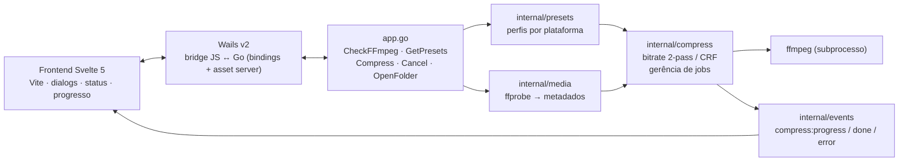
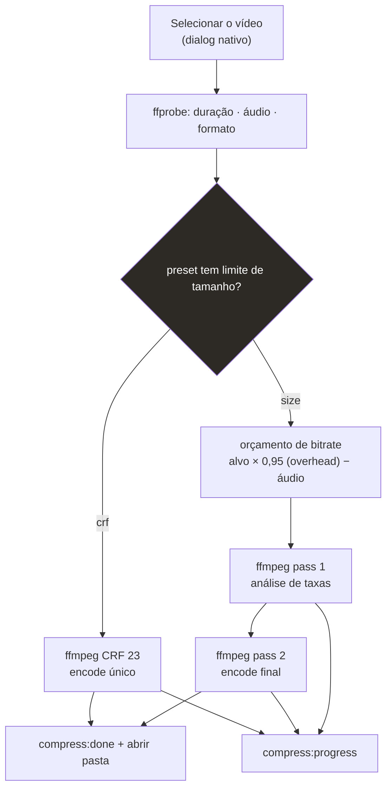
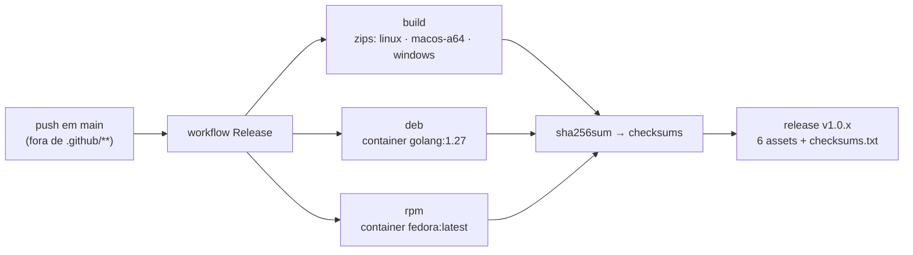

# vidctl

Compressor de vídeo desktop com backend Go (Wails + ffmpeg). Escolha o destino
(WhatsApp, Instagram, Shorts, YouTube) e o app calcula automaticamente o
bitrate para caber no tamanho alvo — preservando a duração e o formato, sem
cortar cena. Alimentado por encode **2-pass** quando há limite de tamanho ou
**CRF** quando é qualidade em primeiro lugar. 100% offline.

## Funcionalidades

- Presets exatos por plataforma (WhatsApp 10/16 MB, Instagram 16 MB, Shorts
  30 MB, YouTube CRF, ou um tamanho livre definido por você)
- Encode ffmpeg **2-pass** para atingir o tamanho máximo sem estourar o limite
- Progresso em tempo real com cancelamento a qualquer momento
- Desktop nativo para **Linux, Windows e macOS** (Wails v2 + WebKit/WebView2)
- Sem internet: fontes e interface bundladas no binário
- Verifica `ffmpeg`/`ffprobe` na inicialização e avisa se faltarem

## Instalação

Baixe a última release em
<https://github.com/fabianoflorentino/vidctl/releases/latest> — cada release
traz todos os pacotes: `.deb` (Debian/Ubuntu), `.rpm` (Fedora/RHEL), zip para
Linux/macOS/Windows e `checksums.txt`.

Guia passo a passo, com verificação de integridade e o ffmpeg por sistema:
**[docs/instalacao.md](docs/instalacao.md)**

## Como funciona

### Arquitetura



### Pipeline de compressão



### Distribuição automática



Os três jobs rodam em paralelo e a **v1.0.x** é publicada com tudo anexado;
não dá para liberar uma release incompleta.

## Presets (destino → tamanho/qualidade)

| Plataforma | Modo | Alvo |
|---|---|---|
| WhatsApp Status | 2-pass | 10 MB |
| WhatsApp (documento) | 2-pass | 16 MB |
| Instagram Reels / Stories | 2-pass | 16 MB |
| YouTube Shorts | 2-pass | 30 MB |
| YouTube (vídeo normal) | CRF 23 | sem limite |
| Tamanho personalizado | 2-pass | definido pelo usuário |

## Stack

- **Backend:** Go 1.25+ (Wails v2.15.0, ffmpeg/ffprobe)
- **Frontend:** Svelte 5 + Vite, com fontes bundladas (funciona offline)

## Pré-requisitos (desenvolvimento)

- Go 1.25+
- Node.js 22+
- Wails CLI: `go install github.com/wailsapp/wails/v2/cmd/wails@v2.15.0`
- ffmpeg e ffprobe no `PATH`
- Linux: pacotes de desenvolvimento GTK/WebKit
  - Debian/Ubuntu: `libgtk-3-dev libwebkit2gtk-4.1-dev`
  - arquiteturas de código antigo (`webkit2gtk-4.0`) não têm build tag própria

## Desenvolvimento

```bash
wails dev -tags webkit2_41
```

A tag `webkit2_41` é necessária no Linux quando o sistema tem só WebKitGTK 4.1.
Em macOS/Windows ela pode ser omitida.

## Build de produção

```bash
wails build -clean -tags webkit2_41
```

O binário sai em `build/bin/vidctl`.

## Testes

```bash
go test ./...
```

Smoke test manual contra um arquivo real (gera um encode 2-pass e checa o tamanho):

```bash
VIDCTL_SMOKE="/caminho/para/video.mp4" go test -run TestSmokeReal -v ./internal/compress/
```

## Estrutura do projeto

```text
.
├── main.go                    # entrypoint Wails + opções da janela
├── app.go                     # bindings expostos ao frontend (dialogs, compress, cancel)
├── internal/
│   ├── compress/              # pipeline ffmpeg: orçamento de bitrate, 2-pass e CRF, gestão de jobs
│   ├── events/                # eventos backend → frontend (progress/done/error)
│   ├── media/                 # leitura de metadados via ffprobe
│   └── presets/               # perfis por plataforma (WhatsApp, Instagram, Shorts, YouTube)
├── frontend/                  # UI Svelte 5 + Vite (bindings em frontend/wailsjs)
├── pkg/
│   ├── aur/                   # PKGBUILD + scripts (instalação estilo AUR)
│   ├── arch/                  # pkg/arch/install.sh (makepkg -si)
│   ├── deb/ · rpm/            # descritores dos pacotes .deb e .rpm
│   └── icon/ · vidctl.desktop
├── docs/                      # documentação de instalação
├── site/                      # landing page estática (Pages)
├── build/                     # recursos de build do Wails (ícone, darwin/windows)
├── .github/workflows/         # CI · Release (zips + deb + rpm) · Pages
└── Makefile                   # dev, build, run, test, check, smoke, clean
```