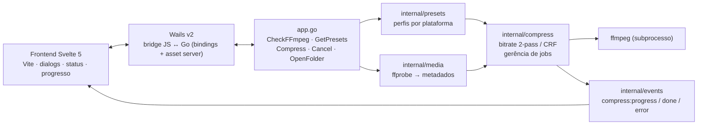
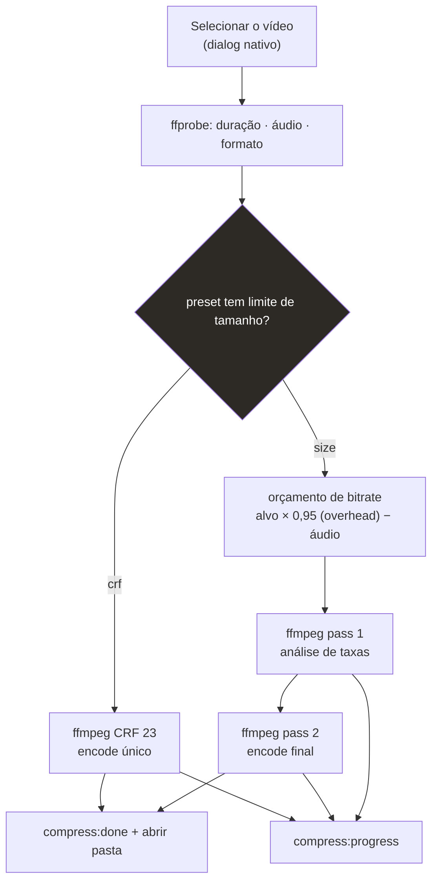
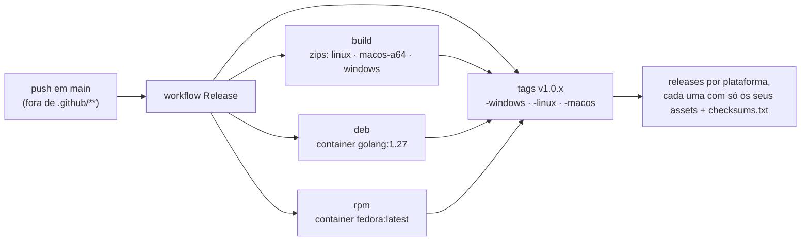

# vidctl

Compressor de vídeo desktop com backend Go (Wails + ffmpeg). Escolha o destino
(WhatsApp, Instagram, Shorts, YouTube) e o app calcula automaticamente o
bitrate para caber no tamanho alvo — preservando a duração e o formato, sem
cortar cena. Alimentado por encode **2-pass** quando há limite de tamanho ou
**CRF** quando é qualidade em primeiro lugar. 100% offline.

> Histórico de versões: [CHANGELOG.md](CHANGELOG.md)

## Funcionalidades

- Presets exatos por plataforma (WhatsApp 10/16 MB, Instagram 16 MB, Shorts
  30 MB, YouTube CRF, ou um tamanho livre definido por você)
- **Corte em partes**: divide o vídeo por tempo — N partes iguais ou X minutos
  por parte (ex.: 30 min → 6 × 5 min) — com mínimo de 1 min por parte; cada
  parte é comprimida de forma independente e sai como `nome-part1.mp4`, …
- Encode ffmpeg **2-pass** para atingir o tamanho máximo sem estourar o limite
- Progresso em tempo real com cancelamento a qualquer momento
- Painel de progresso abaixo do vídeo com leitura de carga do sistema
  (CPU, memória, processo do ffmpeg e GPU NVIDIA quando disponível)
- Desktop nativo para **Linux, Windows e macOS** (Wails v2 + WebKit/WebView2)
- Tema claro/escuro: segue o sistema por padrão e pode ser fixado no botão de
  sol/lua no topo (a escolha persiste entre execuções)
- Sem internet: fontes e interface bundladas no binário
- Verifica `ffmpeg`/`ffprobe` na inicialização e avisa se faltarem; o botão
  "verificar de novo" relê o PATH do sistema, então dá para instalar o ffmpeg
  com o app aberto sem reiniciar
- No Windows, conversões e sondagens de arquivo não abrem janelas de console

## Instalação

Baixe na [página de releases](https://github.com/fabianoflorentino/vidctl/releases)
a tag mais recente que termina no seu sistema — o vidctl publica **uma release
por plataforma**:

| Tag da release | Pacotes |
|---|---|
| `v1.x.y-windows` | `vidctl-windows-x64.zip` + checksums |
| `v1.x.y-macos` | `vidctl-macos-arm64.zip` + checksums |
| `v1.x.y-linux` | zip + `.deb` + `.rpm` + checksums |

Guia passo a passo, com verificação de integridade e o ffmpeg por sistema:
**[docs/instalacao.md](docs/instalacao.md)**

## Como funciona

### Arquitetura



### Pipeline de compressão



### Distribuição automática



Uma **release por plataforma**: uma tag **vX.Y.Z** (ex.: `v2.0.0`) publica três
releases (`vX.Y.Z-windows`, `vX.Y.Z-linux`, `vX.Y.Z-macos`), cada uma com apenas
os binários do seu sistema (a Linux leva zip + deb + rpm). A tag `vX.Y.Z` sem
sufixo é a fonte do tarball usado pelo PKGBUILD (Arch/AUR).

## Presets (destino → tamanho/qualidade)

| Plataforma | Modo | Alvo |
|---|---|---|
| WhatsApp Status | 2-pass | 10 MB |
| WhatsApp (documento) | 2-pass | 16 MB |
| Instagram Reels / Stories | 2-pass | 16 MB |
| YouTube Shorts | 2-pass | 30 MB |
| YouTube (vídeo normal) | CRF 23 | sem limite |
| Tamanho personalizado | 2-pass | definido pelo usuário |

## Corte em partes (split por tempo)

Na barra lateral, o grupo **"Cortar em partes"** divide o vídeo antes de
comprimir — útil quando o destino tem limite de tamanho/duração (ex.: status
de 60 s) ou quando você quer publicar o conteúdo fatiado.

| Campo | Regra |
|---|---|
| **N partes** | o vídeo é dividido em N trechos iguais (ex.: 30 min → 6 × 5 min) |
| **min/parte** | trechos com duração fixa; a sobra vira parte final se tiver ≥ 1 min, senão é juntada na última |
| Mínimo | 1 minuto por parte — cortes que gerem parte menor são bloqueados |
| Máximo | 60 partes por vídeo |

Cada parte passa pelo pipeline de compressão escolhido (preset/tamanho/CRF) e
gera um arquivo `saída-partN.mp4` (índice com zero à esquerda quando são 10+
partes). O progresso mostra `parte X/N` e, ao final, o app resume a economia
total sobre o arquivo original.

## Stack

- **Backend:** Go 1.25+ (Wails v2.15.0, ffmpeg/ffprobe)
- **Frontend:** Svelte 5 + Vite, com fontes bundladas (funciona offline)

## Pré-requisitos (desenvolvimento)

- Go 1.25+
- Node.js 22+
- Wails CLI: `go install github.com/wailsapp/wails/v2/cmd/wails@v2.15.0`
- ffmpeg e ffprobe no `PATH`
- Linux: pacotes de desenvolvimento GTK/WebKit
  - Debian/Ubuntu: `libgtk-3-dev libwebkit2gtk-4.1-dev`
  - arquiteturas de código antigo (`webkit2gtk-4.0`) não têm build tag própria

## Desenvolvimento

```bash
wails dev -tags webkit2_41
```

A tag `webkit2_41` é necessária no Linux quando o sistema tem só WebKitGTK 4.1.
Em macOS/Windows ela pode ser omitida.

## Build de produção

```bash
wails build -clean -tags webkit2_41
```

O binário sai em `build/bin/vidctl`.

## Testes

```bash
go test ./...
make cover        # mede a cobertura (% por função e total)
```

O CI roda os testes com race detector e exige cobertura de **>= 80%**
(`go test -race -shuffle=on -count=1 ./...` + gate no GitHub Actions).

Smoke test manual contra um arquivo real (gera um encode 2-pass e checa o tamanho):

```bash
VIDCTL_SMOKE="/caminho/para/video.mp4" go test -run TestSmokeReal -v ./internal/compress/
```

## Estrutura do projeto

```text
.
├── main.go                    # entrypoint Wails + opções da janela
├── app.go                     # bindings expostos ao frontend (dialogs, compress, cancel)
├── internal/
│   ├── compress/              # pipeline ffmpeg: orçamento de bitrate, 2-pass e CRF, gestão de jobs
│   ├── events/                # eventos backend → frontend (progress/done/error)
│   ├── media/                 # leitura de metadados via ffprobe
│   └── presets/               # perfis por plataforma (WhatsApp, Instagram, Shorts, YouTube)
├── frontend/                  # UI Svelte 5 + Vite (bindings em frontend/wailsjs)
├── pkg/
│   ├── aur/                   # PKGBUILD + scripts (instalação estilo AUR)
│   ├── arch/                  # pkg/arch/install.sh (makepkg -si)
│   ├── deb/ · rpm/            # descritores dos pacotes .deb e .rpm
│   └── icon/ · vidctl.desktop
├── docs/                      # documentação de instalação
├── site/                      # landing page estática (Pages)
├── build/                     # recursos de build do Wails (ícone, darwin/windows)
├── .github/workflows/         # CI · Release (zips + deb + rpm) · Pages
└── Makefile                   # dev, build, run, test, check, smoke, clean
```