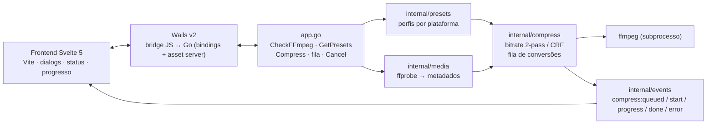
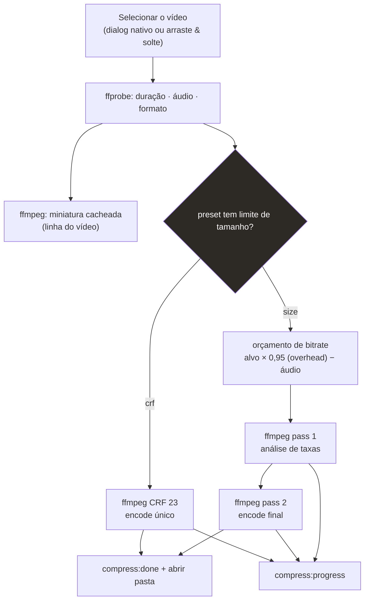
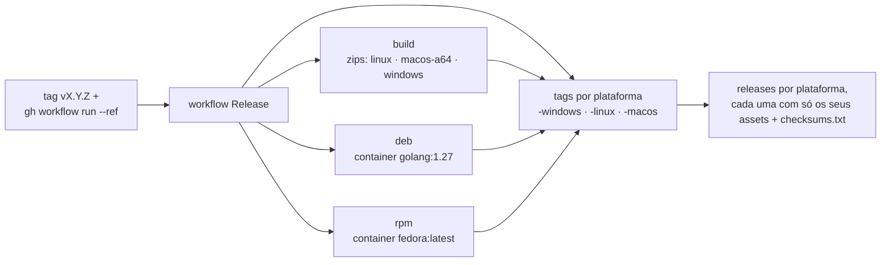

# vidctl

Compressor de vídeo desktop com backend Go (Wails + ffmpeg). Escolha o destino
(WhatsApp, Instagram, Shorts, YouTube) e o app calcula automaticamente o
bitrate para caber no tamanho alvo — preservando a duração e o formato, sem
cortar cena. Alimentado por encode **2-pass** quando há limite de tamanho ou
**CRF** quando é qualidade em primeiro lugar. 100% offline.

> Histórico de versões: [CHANGELOG.md](CHANGELOG.md)

## Funcionalidades

- Presets exatos por plataforma (WhatsApp 10/16 MB, Instagram 16 MB, Shorts
  30 MB, YouTube CRF, ou um tamanho livre definido por você)
- **Corte em partes**: divide o vídeo por tempo — N partes iguais ou X minutos
  por parte (ex.: 30 min → 6 × 5 min) — com mínimo de 1 min por parte; cada
  parte é comprimida de forma independente e sai como `nome-part1.mp4`, …
  O `min/parte` aceita fração (ex.: `1.5` = 1 m 30 s) e os contadores têm
  campo editável + setas com **Shift** para ajuste fino
- **Fila de conversões**: adicione vários vídeos de uma vez ("Adicionar
  vídeos…" ou arrastando vários arquivos) e o app comprime em sequência; a
  fila mostra status, progresso e cancelamento por item, com "limpar fila"
  para os concluídos
- **Drag and drop**: arraste um vídeo para a janela (ou use "Abrir…"); a área
  de seleção vazia vira um alvo destacado quando você passa por cima
- Encode ffmpeg **2-pass** para atingir o tamanho máximo sem estourar o limite
- **Aviso de qualidade antes de comprimir**: o app estima o bitrate que o
  ajuste atual vai render (por parte, quando há corte); se ficar abaixo do
  ideal para a resolução, sugere o alvo em MB ou o corte ideais com um clique
- Progresso em tempo real com cancelamento a qualquer momento
- Painel de progresso abaixo do vídeo com leitura de carga do sistema
  (CPU, memória, processo do ffmpeg e GPU NVIDIA quando disponível)
- Desktop nativo para **Linux, Windows e macOS** (Wails v2 + WebKit/WebView2)
- Tema claro/escuro: segue o sistema por padrão e pode ser fixado no botão de
  sol/lua no topo (a escolha persiste entre execuções)
- Visual no padrão **Constrict**: tema escuro fosco com accent slate, tema
  claro derivado e ícone próprio nos instaladores de todas as plataformas
- Sem internet: fontes e interface bundladas no binário
- Verifica `ffmpeg`/`ffprobe` na inicialização e avisa se faltarem; o botão
  "verificar de novo" relê o PATH do sistema, então dá para instalar o ffmpeg
  com o app aberto sem reiniciar
- **Configuração persistente**: preset, tamanho, CRF e pasta de destino voltam
  como estavam no próximo boot; dá para apontar o ffmpeg/ffprobe para fora do
  PATH em Preferências
- No Windows, conversões e sondagens de arquivo não abrem janelas de console

## Instalação

Baixe na [página de releases](https://github.com/fabianoflorentino/vidctl/releases)
a tag mais recente que termina no seu sistema — o vidctl publica **uma release
por plataforma**:

| Tag da release | Pacotes |
|---|---|
| `v1.x.y-windows` | `vidctl-windows-x64.zip` + checksums |
| `v1.x.y-macos` | `vidctl-macos-arm64.zip` + checksums |
| `v1.x.y-linux` | zip + `.deb` + `.rpm` + checksums |

Guia passo a passo, com verificação de integridade e o ffmpeg por sistema:
**[docs/instalacao.md](docs/instalacao.md)**

## Como funciona

### Arquitetura


```mermaid
flowchart LR
  UI["Frontend Svelte 5<br/>Vite · dialogs · status · progresso"]
  W["Wails v2<br/>bridge JS ↔ Go (bindings + asset server)"]
  APP["app.go<br/>CheckFFmpeg · GetPresets<br/>Compress · fila · Cancel"]
  P["internal/presets<br/>perfis por plataforma"]
  M["internal/media<br/>ffprobe → metadados"]
  C["internal/compress<br/>bitrate 2-pass / CRF<br/>fila de conversões"]
  E["internal/events<br/>compress:queued / start / progress / done / error"]
  F["ffmpeg (subprocesso)"]

  UI <--> W <--> APP
  APP --> P
  P --> C
  APP --> M
  M --> C
  C --> F
  C --> E
  E --> UI
```

### Pipeline de compressão


```mermaid
flowchart TD
  A["Selecionar o vídeo<br/>(dialog nativo ou arraste & solte)"] --> B["ffprobe: duração · áudio · formato"]
  B --> T["ffmpeg: miniatura cacheada<br/>(linha do vídeo)"]
  B --> C{"preset tem limite de tamanho?"}
  C -- "size" --> D["orçamento de bitrate<br/>alvo × 0,95 (overhead) − áudio"]
  D --> E["ffmpeg pass 1<br/>análise de taxas"]
  E --> F["ffmpeg pass 2<br/>encode final"]
  F --> G["compress:done + abrir pasta"]
  C -- "crf" --> H["ffmpeg CRF 23<br/>encode único"]
  H --> G
  E --> X["compress:progress"]
  F --> X
  H --> X

  style C fill:#2d2a26,color:#fff
```

### Distribuição automática


```mermaid
flowchart LR
  P["tag vX.Y.Z +<br/>gh workflow run --ref"] --> R["workflow Release"]
  R --> Z["build<br/>zips: linux · macos-a64 · windows"]
  R --> D["deb<br/>container golang:1.27"]
  R --> E["rpm<br/>container fedora:latest"]
  R --> T["tags por plataforma<br/>-windows · -linux · -macos"]
  Z --> T
  D --> T
  E --> T
  T --> L["releases por plataforma,<br/>cada uma com só os seus assets + checksums.txt"]
```

Uma **release por plataforma**: uma tag **vX.Y.Z** (ex.: `v2.0.0`) publica três
releases (`vX.Y.Z-windows`, `vX.Y.Z-linux`, `vX.Y.Z-macos`), cada uma com apenas
os binários do seu sistema (a Linux leva zip + deb + rpm). A tag `vX.Y.Z` sem
sufixo é a fonte do tarball usado pelo PKGBUILD (Arch/AUR).

## Configuração

As preferências ficam em `config.json`, dentro da pasta de configuração do
usuário:

| Sistema | Caminho |
|---|---|
| Linux | `~/.config/vidctl/config.json` |
| macOS | `~/Library/Application Support/vidctl/config.json` |
| Windows | `%AppData%\vidctl\config.json` |

O arquivo é escrito de forma atômica ( temporário + `rename`), então uma queda
no meio da gravação não corrompe as preferências. Se o arquivo estiver ausente
ou inválido, o app abre com os valores padrão em vez de falhar.

| Campo | Padrão | O que faz |
|---|---|---|
| `presetId` | `whatsapp-status` | preset selecionado na sidebar |
| `sizeMB` | `10` | alvo em MB dos presets de tamanho |
| `crf` | `23` | CRF dos presets de qualidade |
| `outputDir` | vazio | pasta de destino; vazio = ao lado do vídeo original |
| `ffmpegPath` | vazio | caminho do ffmpeg; vazio = procurar no PATH |
| `ffprobePath` | vazio | caminho do ffprobe; vazio = procurar no PATH |
| `language` | `pt` | idioma da interface (usado a partir da fase de i18n) |
| `maxParallel` | `1` | quantos vídeos comprimir ao mesmo tempo (fila) |
| `notifyOnDone` | `false` | notificar ao terminar |
| `openFolderOnDone` | `false` | abrir a pasta de saída ao terminar |

`maxParallel` já vale para a fila de conversões (aplicado na inicialização e ao
salvar as Preferências); `notifyOnDone`, `openFolderOnDone` e `language` ficam
preservados no arquivo mas só passam a ter efeito com as fases de notificação e
i18n do [plano](docs/plano-implementacao.md).

Você também pode editar o arquivo à mão: valores fora da faixa (CRF acima de
51, `maxParallel` abaixo de 1) são corrigidos na leitura, e o resto é preservado
inclusive campos de versões futuras.

### Binários fora do PATH

Se o ffmpeg não estiver no PATH — ou você quiser uma build específica — abra
**Preferências** e preencha `ffmpeg` e/ou `ffprobe`. O caminho configurado tem
prioridade sobre o PATH e vale imediatamente, sem reiniciar. Um caminho que não
existe é reportado como erro em vez de cair silenciosamente no binário do PATH,
e o botão "verificar de novo" confere o resultado.

## Presets (destino → tamanho/qualidade)

| Plataforma | Modo | Alvo |
|---|---|---|
| WhatsApp Status | 2-pass | 10 MB |
| WhatsApp (documento) | 2-pass | 16 MB |
| Instagram Reels / Stories | 2-pass | 16 MB |
| YouTube Shorts | 2-pass | 30 MB |
| YouTube (vídeo normal) | CRF 23 | sem limite |
| Tamanho personalizado | 2-pass | definido pelo usuário |

## Estimativa de tamanho

Antes de comprimir, o vidctl mostra no painel "Tamanho alvo" o tamanho que a
saída deve ter (badge "esperado ≈ X MB") e a economia em relação ao arquivo
original, quando o alvo é menor. No modo `size` a previsão é exata: ela usa o
mesmo orçamento de bits do encode 2-pass (alvo × 0,95 de overhead − áudio,
com um orçamento por parte em cortes), então o resultado real fica a poucos
pontos percentuais do esperado em conteúdo que preenche o orçamento. Em modo
CRF ainda não há previsão determinística e o badge não aparece.

## Codecs e aceleração de GPU

No passo 02, o cartão **"Avançado"** troca o codec de vídeo e o codificador
para aquele trabalho, sem alterar o preset salvo:

| Opção | Codificador | 2-pass (tamanho) | Controle de tamanho |
|---|---|---|---|
| Software (CPU) | `libx264` / `libx265` | ✅ | ✅ preciso |
| NVIDIA NVENC | `h264_nvenc` / `hevc_nvenc` | ❌ | VBR 1-pass (±5–10%) |
| Intel QSV | `h264_qsv` / `hevc_qsv` | ✅ | ✅ |
| AMD AMF | `h264_amf` / `hevc_amf` | ❌ | VBR 1-pass (±5–10%) |
| Apple VideoToolbox | `h264_videotoolbox` / `hevc_videotoolbox` | ❌ | VBR 1-pass |

- **Software continua o default**: o 2-pass do modo `size` é o único caminho
  com previsão exata de tamanho (a estimativa no painel usa o mesmo orçamento).
  Aceleração de GPU é muito mais rápida e libera a CPU, mas costuma exigir
  ~20–30% mais bitrate para igualar a qualidade do software — por isso a UI
  avisa quando um codificador de GPU está ativo e o modo `size` pode variar
  em ±5–10% do alvo.
- **H.265 ≠ GPU**: HEVC encolhe o arquivo na mesma qualidade (ou melhora a
  qualidade no mesmo tamanho), mas em software ele é *mais lento* que H.264. O
  ganho real de velocidade vem do hardware, não do codec.
- **"Automático"** ativa o primeiro backend de hardware detectado
  (NVENC → QSV → AMF → VideoToolbox), com fallback para software se nenhum
  funcionar.
- **Detecção**: o app lista os encoders do seu `ffmpeg`
  (`ffmpeg -hide_banner -encoders`, em cache) e roda um probe de 1 frame para
  confirmar que o driver da GPU funciona. Backends que falham aparecem
  desabilitados com o motivo; "verificar de novo" no cartão re-detecta (ex.:
  depois de instalar o driver).

## Corte em partes (split por tempo)

Na barra lateral, o grupo **"Cortar em partes"** divide o vídeo antes de
comprimir — útil quando o destino tem limite de tamanho/duração (ex.: status
de 60 s) ou quando você quer publicar o conteúdo fatiado.

| Campo | Regra |
|---|---|
| **N partes** | o vídeo é dividido em N trechos iguais (ex.: 30 min → 6 × 5 min) |
| **min/parte** | trechos com duração fixa (aceita fração: `1.5` = 1 m 30 s); a sobra vira parte final se tiver ≥ 1 min, senão é juntada na última |
| Mínimo | 1 minuto por parte — cortes que gerem parte menor são bloqueados |
| Máximo | 60 partes por vídeo |

Cada parte passa pelo pipeline de compressão escolhido (preset/tamanho/CRF) e
gera um arquivo `saída-partN.mp4` (índice com zero à esquerda quando são 10+
partes). O progresso mostra `parte X/N` e, ao final, o app resume a economia
total sobre o arquivo original.

## Ajustes por arquivo

O grupo **"Ajustes por arquivo"** aplica controles extras ao vídeo *depois* do
preset, também por trabalho:

| Controle | Comportamento |
|---|---|
| **Escala** | **Padrão** limita a 1280px no lado maior (comportamento normal); **Original** mantém a resolução da fonte (sem filtro de escala); **Personalizado** usa `LARGURAxALTURA` (ex.: `1280x720`) preservando a proporção |
| **Corte** | `início`/`fim` em `mm:ss` guardam **uma janela** do vídeo (ex.: só o trecho 1:00–3:30), com seek antes do decode (`-ss/-to` antes de `-i`); o orçamento de tamanho e o progresso consideram a duração cortada |
| **Remover áudio** | saída sem trilha de áudio (`-an` / sem `-c:a`) |
| **FPS** | sobrescreve os quadros por segundo (`fps=<N>`); `0` mantém o da fonte |
| **Orientação** | gira 90°, 180° ou 270° (`transpose`, aplicado antes da escala) |
| **Thumbnail** | após o encode, extrai um quadro do vídeo de saída para o arquivo escolhido (`ffmpeg -ss <meio> -frames:v 1`) |

A ordem dos filtros de vídeo é sempre `transpose → scale → fps`. Corte manual
e **"Cortar em partes"** não podem ser combinados. Formatos de tempo aceitos:
`90` (segundos), `1:30` (minutos:segundos) e `1:02:30` (horas).

## Fila de conversões

O botão **"Adicionar vídeos…"** (ou arrastar vários arquivos de uma vez para a
janela) enfileira um trabalho por arquivo — cada um com o preset/tamanho
atuais e a saída sugerida ao lado do original. A fila aparece abaixo do vídeo
com nome, preset, status e barra de progresso do item em execução, e permite
cancelar item a item ou **limpar fila** (remove concluídos, erros e
cancelados).

- A quantidade de vídeos processando ao mesmo tempo vem de `maxParallel` na
  `config.json` (padrão **1** = sequencial); edite o arquivo e reabra o app
  para valer.
- "Comprimir…" continua enfileirando o vídeo selecionado na sidebar, e a barra
  de ações fica sempre disponível — só "Adicionar vídeos…" depende do ffmpeg.
- O progresso é por trabalho (`compress:queued`, `compress:start`,
  `compress:progress`, `compress:done`, `compress:error`), então um erro em um
  item não derruba os demais.

## Stack

- **Backend:** Go 1.25+ (Wails v2.16.0, ffmpeg/ffprobe)
- **Frontend:** Svelte 5 + Vite, com fontes bundladas (funciona offline)

## Pré-requisitos (desenvolvimento)

- Go 1.25+
- Node.js 22+
- Wails CLI: `go install github.com/wailsapp/wails/v2/cmd/wails@v2.16.0`
- ffmpeg e ffprobe no `PATH`
- Linux: pacotes de desenvolvimento GTK/WebKit
  - Debian/Ubuntu: `libgtk-3-dev libwebkit2gtk-4.1-dev`
  - arquiteturas de código antigo (`webkit2gtk-4.0`) não têm build tag própria

## Desenvolvimento

```bash
wails dev -tags webkit2_41
```

A tag `webkit2_41` é necessária no Linux quando o sistema tem só WebKitGTK 4.1.
Em macOS/Windows ela pode ser omitida.

### Depuração local

Para rastrear o pipeline no binário compilado (fila, eventos de progresso e
erros de JS), ligue o modo de diagnóstico:

```bash
make build
VIDCTL_DEBUG=1 ./build/bin/vidctl
```

O terminal recebe, com timestamp, cada transição da fila (enfileirar,
iniciar, fim de worker), cada evento emitido para a UI e cada evento
recebido no frontend — incluindo patches descartados por estado — além das
exceções de JavaScript. Sem `VIDCTL_DEBUG` o log fica desligado, sem custo.

## Build de produção

```bash
wails build -clean -tags webkit2_41
```

O binário sai em `build/bin/vidctl`.

## Testes

```bash
go test ./...
make cover        # mede a cobertura (% por função e total)
```

O CI roda os testes com race detector e exige cobertura de **>= 80%**
(`go test -race -shuffle=on -count=1 ./...` + gate no GitHub Actions).

Smoke test manual contra um arquivo real (gera um encode 2-pass e checa o tamanho):

```bash
VIDCTL_SMOKE="/caminho/para/video.mp4" go test -run TestSmokeReal -v ./internal/compress/
```

## Estrutura do projeto

```text
.
├── main.go                    # entrypoint Wails + opções da janela
├── app.go                     # bindings expostos ao frontend (dialogs, compress, cancel)
├── internal/
│   ├── cmdutil/                 # criação de subprocessos e busca de binários (com override do PATH)
│   ├── compress/                # pipeline ffmpeg: orçamento de bitrate, 2-pass e CRF, gestão de jobs
│   ├── config/                  # preferências persistidas em config.json (leitura/escrita atômica)
│   ├── events/                  # eventos backend → frontend (progress/done/error)
│   ├── media/                   # leitura de metadados via ffprobe e miniaturas via ffmpeg
│   ├── presets/                 # perfis por plataforma (WhatsApp, Instagram, Shorts, YouTube)
│   ├── split/                   # plano de corte em partes (N partes ou min/parte)
│   └── sysinfo/                 # uso de CPU/memória/GPU para o painel de progresso
├── frontend/                    # UI Svelte 5 + Vite (bindings em frontend/wailsjs)
├── pkg/
│   ├── aur/                     # PKGBUILD + scripts (instalação estilo AUR)
│   ├── arch/                    # pkg/arch/install.sh (makepkg -si)
│   ├── deb/ · rpm/              # descritores dos pacotes .deb e .rpm
│   └── icon/ · vidctl.desktop
├── docs/                        # instalação, backlog e planos de implementação
├── site/                      # landing page estática (Pages)
├── build/                     # recursos de build do Wails (ícone, darwin/windows)
├── .github/workflows/         # CI · Release (zips + deb + rpm) · Pages
└── Makefile                   # dev, build, run, test, check, smoke, clean
```